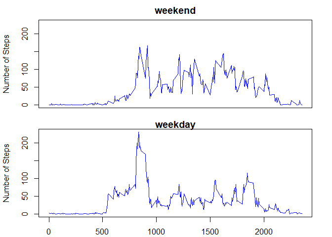

## Loading and preprocessing the data


```r
library(dplyr)
```

```
## 
## Attaching package: 'dplyr'
```

```
## The following objects are masked from 'package:stats':
## 
##     filter, lag
```

```
## The following objects are masked from 'package:base':
## 
##     intersect, setdiff, setequal, union
```

```r
temp<-tempfile()
data_url<-"https://d396qusza40orc.cloudfront.net/repdata%2Fdata%2Factivity.zip"
download.file(data_url, temp)
dat <- read.csv(unz(temp,"activity.csv"))
dat$date <- as.Date(dat$date)
unlink(temp)
```

## What is mean total number of steps taken per day?

- Total number of steps taken per day


```r
total_steps <- dat %>% group_by(date) %>% summarise(total_steps = sum(steps))
hist(total_steps$total_steps,
     main = "Total Number of Steps Taken Each Daty",
     xlab = "Total Step Taken Each Day", col = "light blue")
```

<!-- -->
- The mean and median of the total number of steps taken per date


```r
mm_data <- dat %>% group_by(date) %>% 
  summarise(total = sum(steps)) %>% 
  summarise(Mean = mean(total, na.rm = TRUE), 
            Median = median(total, na.rm = TRUE))

print(mm_data, quote = FALSE, row_names = FALSE, n = dim(mm_data)[1])
```

```
## # A tibble: 1 x 2
##    Mean Median
##   <dbl>  <int>
## 1 10766  10765
```

## What is the average daily activity pattern?


```r
im_data <- dat %>% group_by(interval) %>% 
  summarise(Mean = mean(steps, na.rm = TRUE)) 

plot(x=im_data$interval, y=im_data$Mean, type = "l", 
     main = "Average Number of Steps per Interval",
     xlab = "5-minute Interval", ylab = "Number of Steps", col = "blue")
```

<!-- -->

```r
print(im_data[im_data$Mean == max(im_data$Mean), ])
```

```
## # A tibble: 1 x 2
##   interval  Mean
##      <int> <dbl>
## 1      835   206
```

## Imputing missing values

- Total number of missing values.


```r
summarise(dat, total = sum(is.na(dat$steps)),
          percentage = mean(is.na(dat$steps)) * 100)
```

```
##   total percentage
## 1  2304   13.11475
```

- Filling the missing steps values with the mean for that 5-minute interval.


```r
dat1 <- dat
dat1$steps <- ifelse(is.na(dat1$steps),
                     im_data$Mean[match(dat1$interval, im_data$interval)],
                     dat1$steps)
total_steps <- dat1 %>% group_by(date) %>% summarise(total_steps = sum(steps))
hist(total_steps$total_steps,
     main = "Total Number of Steps Taken Each Daty Without Missing Data",
     xlab = "Total Step Taken Each Day", col = "light green")
```

<!-- -->

- The mean and median of the total number of steps taken per date without missing data.


```r
mm_data <- dat1 %>% group_by(date) %>% 
  summarise(total = sum(steps)) %>% 
  summarise(Mean = mean(total, na.rm = TRUE), 
            Median = median(total, na.rm = TRUE))

print(mm_data, quote = FALSE, row_names = FALSE, n = dim(mm_data)[1])
```

```
## # A tibble: 1 x 2
##    Mean Median
##   <dbl>  <dbl>
## 1 10766  10766
```

## Are there differences in activity patterns between weekdays and weekends?

- Create a day_type (weekday and weekend) variable

```r
dat2 <- mutate(dat1,day_type = ifelse(weekdays(dat1$date) %in%
  c("Saturday", "Sunday"),"weekend","weekday"))

dat2$day_type <- as.factor(dat2$day_type)

im_data_weekend <- dat2 %>% filter(day_type == "weekend") %>%
  group_by(interval) %>% summarise(Mean = mean(steps))

im_data_weekday <- dat2 %>% filter(day_type == "weekday") %>%
  group_by(interval) %>% summarise(Mean = mean(steps))

par(mfrow = c(2,1))
par(mar = c(1.1,4.1,2.1,2.1))
weekday_max = max(im_data_weekend$Mean)
weekend_max = max(im_data_weekday$Mean)
ymax = max(c(weekend_max,weekday_max))
plot(x=im_data_weekend$interval, y=im_data_weekend$Mean, type = "l", 
     main = "weekend", xaxt = "n", ylim = c(0, ymax), 
     xlab = "", ylab = "Number of Steps", col = "blue")
par(mar = c(2.1,4.1,1.1,2.1))
plot(x=im_data_weekday$interval, y=im_data_weekday$Mean, type = "l", 
     main = "weekday", ylim = c(0, ymax),
     xlab = "5-minute Interval", ylab = "Number of Steps", col = "blue")
```

<!-- -->
